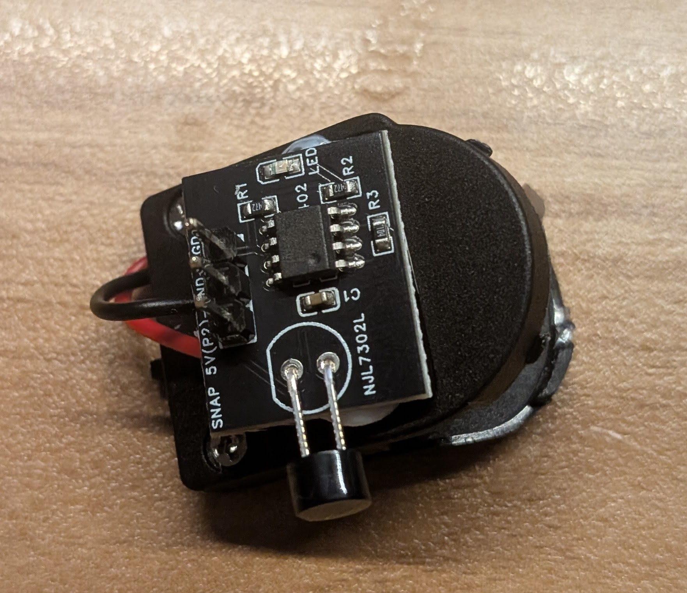
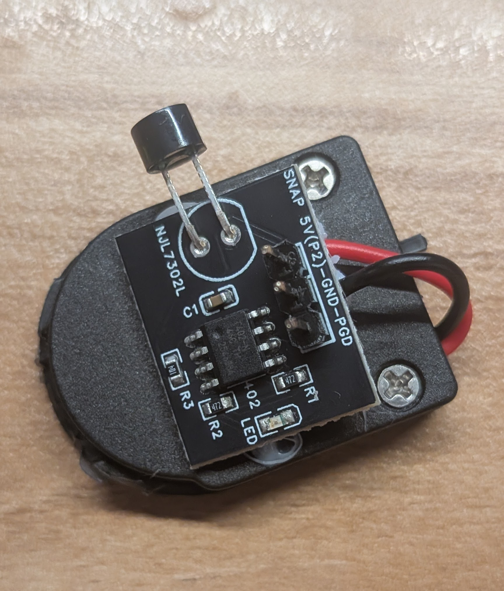
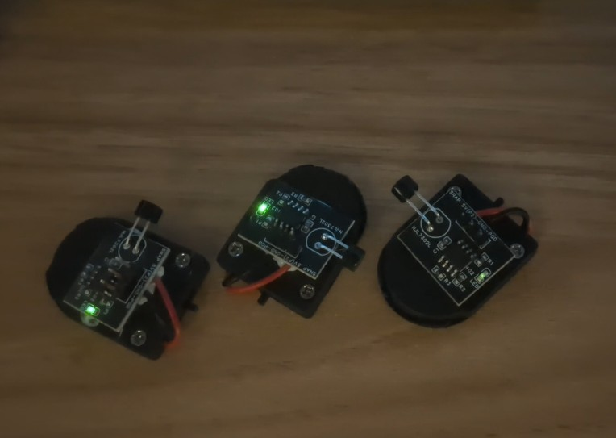
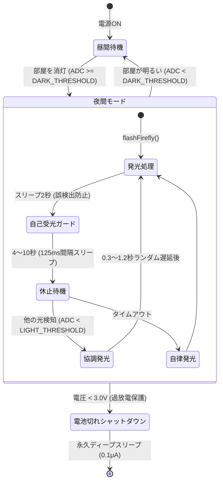

# FireFlies（電子ホタル集団同期明滅プロジェクト）

自然界のホタル（ゲンジボタル）に見られる**「集団同期明滅（引き込み現象）」**を超小型マイコン（ATtiny402）と光学センサのみで自律的に再現する電子ホタルプロジェクトです。

無線通信や親機（中央制御）を使わず、**「相手の放った光を見る $\to$ わずかに遅れて自分も光る」** という局所的な光フィードバックのみで、複数のホタルモジュールを並べると徐々に呼吸を合わせるように一斉同調発光します。

---

## 🌟 主な特徴・コンセプト

1. **自律分散型の協調発光（引き込みモデル）**
   - 個々のホタルが独立したタイマーで明滅します。
   - 消灯休止中に他のホタルの光を浴びると、休止時間を切り上げて 0.3〜1.2 秒のランダム遅延後に自分も発光を開始します。
   - 複数個が互いの光を浴び合うことで、蔵本モデル（非線形結合振動子の同期現象）のように群れ全体のリズムが自然と揃っていきます。

2. **リアルなゲンジボタルの明滅カーブ**
   - 単純な線形PWMではなく、二乗則を用いた呼吸のような立ち上がり（フェードイン）$\to$ 2〜4秒間の発光維持 $\to$ 余韻を残したフェードアウト $\to$ 4〜10秒間のゆらぎ休止を再現しています。

3. **超低消費電力スリープ（約 1 ヶ月の電池寿命）**
   - ATtiny402 内部の超低消費電力 32.768kHz 発振器と PIT（Periodic Interrupt Timer）を使用。
   - 待機・休止中は CPU を **Power Down スリープ（約 1μA）** させ、125ms（8Hz）ごとに一瞬だけ起きて受光センサをチェック。
   - 小型充電池（LIR2032: 実効約45mAh）でありながら、平均消費電流を約 50μA に抑え、**一晩で電池切れすることなく約 37 日間の連続稼働** を実現しています。

4. **安全なバッテリー過放電保護（UVLO）**
   - マイコン内部の基準電圧を用いて電源電圧（VDD）をリアルタイム監視。
   - 電圧が **3.0V を下回ると LED を短く2回点滅してお知らせし、永久ディープスリープ（消費電流 ~0.1μA）で安全に自動シャットダウン**。
   - 保護回路のないコイン型リチウムイオン電池が危険な過放電（1.2V等のセル破壊域）に陥るのを防ぎます。

5. **5V / 3.7V デュアル電源対応**
   - 設定マクロ（`#define USE_BATTERY_3V7`）を 1 行切り替えるだけで、USB/5V動作確認モードと 3.7V充電池モードに最適化された閾値・輝度が自動適用されます。

---

## 🛠 ハードウェア仕様

| 項目 | 仕様・部品 | 備考 |
| :--- | :--- | :--- |
| **マイコン (MCU)** | Microchip ATtiny402 (SOIC-8) | 超小型8ピンAVR (20MHz/内部発振) |
| **受光センサ** | フォトトランジスタ PT19-21C/L41/TR8 | PA7 / ADC (物理3ピン) + 100kΩ プルアップ |
| **発光素子** | チップLED (緑色 / 0603 or 1608) | PA2 / PWM (物理5ピン) + 4.7kΩ 電流制限抵抗 |
| **電源** | LIR2032 (3.7V 充電式コイン電池, 70mAh)<br>または 5V (USB電源) | CR2032電池ホルダー等に実装 |
| **書き込みインターフェース** | UPDI (MPLAB SNAP 等) | PA0 / UPDI (物理6ピン) + 4.7kΩ プルアップ |
| **筐体** | 3Dプリント外装（リアルなホタル形状） | 作成中 |

---

## 📄 設計資料・回路図リンク (`docs/`)

回路・基板に関する各種設計資料は [`docs/`](docs/) ディレクトリに収録されています。

* **回路図 (SVG)**: [`docs/circuit_v1.svg`](docs/circuit_v1.svg)
  * SchemDraw で描画された視認性の高い回路図
* **回路作図スクリプト**: [`docs/make_circuit_draw.py`](docs/make_circuit_draw.py)
  * Python の SchemDraw ライブラリを用いて回路図 SVG を自動生成するスクリプト
* **回路図 (PDF/EasyEDA)**: [`docs/SCH_Schematic1_2026-09-01.pdf`](docs/SCH_Schematic1_2026-09-01.pdf)
  * EasyEDA で設計された正式な回路図面
* **基板アートワーク (PDF/EasyEDA)**: [`docs/PCB_PCB1_2026-09-01.pdf`](docs/PCB_PCB1_2026-09-01.pdf)
  * 実装基板のレイアウトおよび配線パターン図

### 実機・動作確認ギャラリー (`docs/imgs/`)

| モジュール外観（斜視） | モジュール外観（上面） | 同期明滅テスト風景 |
| :---: | :---: | :---: |
| [](docs/imgs/module_close_up.jpg) | [](docs/imgs/module_top_view.jpg) | [](docs/imgs/sync_glow_test.jpg) |

---

## 💻 ソフトウェア・アルゴリズム (`Arduino/FireFly/`)

メインプログラム: [`Arduino/FireFly/FireFly.ino`](Arduino/FireFly/FireFly.ino)

### 状態遷移フロー



### 設定パラメータの比較

| パラメータ名 | 3.7V 充電池モード (`USE_BATTERY_3V7 = true`) | 5V 電源モード (`USE_BATTERY_3V7 = false`) | 説明 |
| :--- | :--- | :--- | :--- |
| `DARK_THRESHOLD` | **800** (約2.9V以上) | **819** (4.0V以上) | 周囲が暗くなった（夜）と判定するADC閾値 |
| `LIGHT_THRESHOLD` | **640** (約2.3V以下) | **720** (約3.5V以下) | 他のホタルの光を検知するADC閾値 |
| `ABSOLUTE_MAX_BRIGHTNESS` | **255** (100% PWM) | **200** (約78% PWM) | LED発光の最大輝度 |
| `LOW_BATTERY_VOLTAGE_MV` | **3000 mV** (3.0V) | **0 mV** (無効) | 過放電保護シャットダウン閾値 |

---

## 📂 ディレクトリ構成

```text
FireFlies/
├── README.md               # 本ドキュメント
├── Arduino/
│   ├── FireFly/
│   │   └── FireFly.ino     # ホタル同期発光ファームウェア（スリープ＆過放電保護内蔵）
│   └── LEDTest/            # LED・受光テスト用スケッチ
├── docs/                   # 回路図・基板設計資料
│   ├── circuit_v1.svg      # 回路図 (SVG)
│   ├── make_circuit_draw.py# 回路作図スクリプト
│   ├── SCH_Schematic1_2026-09-01.pdf # 回路図面 (PDF)
│   └── PCB_PCB1_2026-09-01.pdf       # 基板レイアウト図面 (PDF)
├── 3DModel/                # 外装・モデルデータ (.3mf, .png, Pythonスクリプト)
└── EasyEDA/                # EasyEDA プロジェクトファイル格納用
```

---

## 🔧 ビルド・書き込み方法

1. **開発環境の準備**:
   * Arduino IDE をインストール。
   * ボードマネージャに **`megaTinyCore`**（by Spence Konde）を導入。
2. **ボード設定**:
   * ボード: `ATtiny402/202`
   * チップ: `ATtiny402`
   * クロック: `20MHz Internal`（または `16MHz`）
3. **書き込み**:
   * プログラマに UPDI 対応機器（MPLAB SNAP、jtag2updi、SerialUPDI 等）を選択し、ファームウェアを書き込みます。
